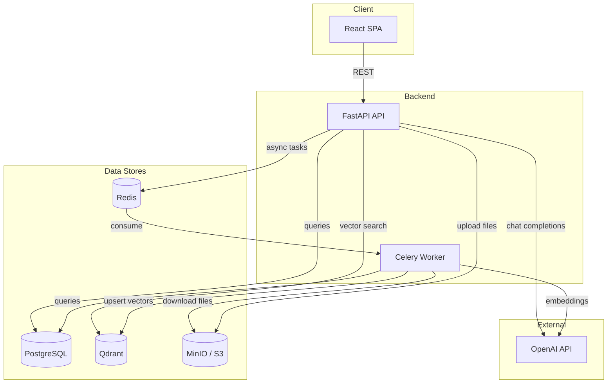
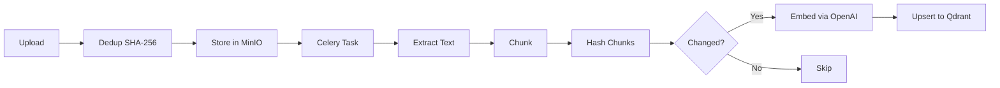
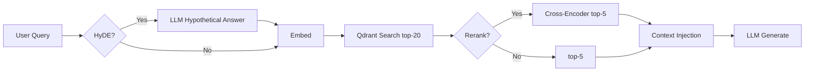

# RAG Platform

Production-ready Retrieval-Augmented Generation platform. Upload documents, chat with AI that retrieves relevant context from your files.

## Stack

| Layer           | Tech                                          |
| --------------- | --------------------------------------------- |
| API             | Python 3.12, FastAPI, Pydantic v2             |
| Database        | PostgreSQL, SQLAlchemy 2.0 (async)            |
| Background Jobs | Redis, Celery                                 |
| Vector DB       | Qdrant                                        |
| Object Storage  | MinIO (S3-compatible) — local & prod          |
| LLM             | OpenAI (gpt-4o-mini, text-embedding-3-small)  |
| PDF/OCR         | PyMuPDF, pdfplumber (tables), Tesseract (OCR) |
| Auth            | FastAPI-Users (JWT)                           |
| Frontend        | Vite + React + TypeScript + Tailwind          |

## Quick Start

```bash
# Clone and start all services (7 containers)
docker compose up

# API:          http://localhost:8010
# Docs:         http://localhost:8010/docs
# Frontend:     http://localhost:3000
# MinIO Console: http://localhost:9001  (minioadmin/minioadmin)
```

Requires Docker and a `.env` file (copy from `.env.example`).

## Architecture



### Ingest Pipeline



### Retrieval Pipeline



### Project Structure

```text
backend/
  app/
    api/v1/          — Routers (auth, users, conversations, documents, metrics)
    core/            — Config, auth (FastAPI-Users), rate limiting, middleware, exceptions
    services/        — Business logic (llm chat, conversation, document)
    rag/             — RAG pipeline (chunker, embedder, retriever, ingest)
    eval/            — Evaluation pipeline (metrics, A/B runner, CLI)
    tasks/           — Celery tasks (thin wrappers around rag.ingest)
    models/          — SQLAlchemy ORM models
    schemas/         — Pydantic request/response schemas
    utils/           — Vector DB client, document extractor, object storage, tracing, metrics
    db/              — Engine, session factory

web/                 — React SPA (Vite + React 19 + TypeScript + Tailwind 4)
infra/               — Terraform (AWS deployment)
```

## API Endpoints

### Auth (FastAPI-Users)

```text
POST   /api/v1/auth/register
POST   /api/v1/auth/login
POST   /api/v1/auth/forgot-password
POST   /api/v1/auth/reset-password
POST   /api/v1/auth/verify
```

### Users

```text
GET    /api/v1/users/me
PATCH  /api/v1/users/me
```

### Documents

```text
POST   /api/v1/documents/upload       — upload file + async ingest
GET    /api/v1/documents              — list (paginated, user-scoped)
GET    /api/v1/documents/{id}
PUT    /api/v1/documents/{id}         — update + re-index
DELETE /api/v1/documents/{id}         — delete + remove vectors
```

### Conversations (RAG-powered)

```text
POST   /api/v1/conversations
GET    /api/v1/conversations
GET    /api/v1/conversations/{id}     — with messages
PATCH  /api/v1/conversations/{id}     — update title
DELETE /api/v1/conversations/{id}
POST   /api/v1/conversations/{id}/messages  — send message (auto RAG retrieval)
```

### Metrics

```text
GET    /api/v1/metrics/summary        — aggregated stats (requests, latency, RAG metrics)
```

### System

```text
GET    /health                        — liveness
GET    /ready                         — readiness (DB + Redis + Qdrant)
```

## RAG Pipeline

```text
Ingest:  upload → dedup (SHA-256) → store in MinIO → extract (PyMuPDF + tables + OCR)
         → semantic chunk → incremental embed (only changed chunks) → upsert to Qdrant
Chat:    query → [HyDE] → embed → vector search (user-scoped, top-20) → [rerank] → top-5 → LLM generate
```

| Stage | Technique | Toggle |
| ----- | --------- | ------ |
| PDF Extraction | PyMuPDF + pdfplumber (tables as markdown) | Always on |
| OCR | Tesseract via pytesseract (scanned PDFs) | `OCR_ENABLED` |
| Deduplication | SHA-256 file hash, chunk-level incremental re-index | Always on |
| Chunking | Recursive sentence-aware splitter (512 chars, 50 overlap) | Always on |
| Embedding | OpenAI text-embedding-3-small (1536d) | Always on |
| HyDE | LLM generates hypothetical answer → embed that | `HYDE_ENABLED` |
| Reranker | Cross-encoder ms-marco-MiniLM-L-6-v2 (top-20 → top-5) | `RERANKER_ENABLED` |

## Evaluation

Compare RAG pipeline variants (baseline vs +reranker vs +hyde vs all) with retrieval and generation metrics.

```bash
# Run inside backend container (requires services running)
docker compose exec api python -m app.eval \
  --dataset app/eval/sample_dataset.json \
  --user-id <uuid>

# Skip LLM-as-judge (faster, retrieval metrics only)
docker compose exec api python -m app.eval \
  --dataset app/eval/sample_dataset.json \
  --user-id <uuid> \
  --skip-generation

# Select specific configs + output to file
docker compose exec api python -m app.eval \
  --dataset app/eval/sample_dataset.json \
  --user-id <uuid> \
  --configs baseline +reranker +hyde +all \
  --output results.md
```

Metrics: Precision@k, Recall@k, MRR, Hit Rate, Faithfulness (LLM-as-judge), Answer Relevance, Latency p50/p95/p99.

## Observability

RAG pipeline tracing with structured JSON spans (embed_query, vector_search, rerank, llm_generate). Each span records latency, token counts, and retrieval scores.

```bash
# Get aggregated metrics
curl http://localhost:8010/api/v1/metrics/summary
```

Returns: total requests, avg/p95 latency, error rate, RAG-specific latency, avg retrieval score.

Configure via `OBSERVABILITY_PROVIDER`: `json` (structured logs) or `none` (disabled).

## AWS Deployment

Terraform-managed infrastructure on AWS (ECS Fargate). Estimated cost: ~$0.17/hr.

```bash
# One-time: create Terraform state backend (S3 + DynamoDB)
./scripts/setup-state.sh

# Configure secrets
cp infra/terraform.tfvars.example infra/terraform.tfvars
# Edit terraform.tfvars with your values

# Deploy (infra + build + push + migrate + deploy ECS)
./scripts/deploy.sh

# Teardown (destroy all AWS resources)
./scripts/teardown.sh
```

**Services:** ECS Fargate (API + Worker + Web) | RDS PostgreSQL (db.t3.micro) | ElastiCache Redis (cache.t3.micro) | ALB | S3 | Qdrant Cloud (free tier)

**CI/CD:** GitHub Actions — `ci-cd.yml` (lint + test on push/PR) → `deploy.yml` (manual trigger: deploy or destroy)

See [infra/README.md](infra/README.md) for full details.

## Development

```bash
cd backend

# Lint + format
ruff check app/ tests/
ruff format app/ tests/

# Tests
pytest

# Migrations
alembic revision --autogenerate -m "description"
alembic upgrade head
```

## Environment Variables

| Variable                 | Description                     | Default                 |
| ------------------------ | ------------------------------- | ----------------------- |
| `DATABASE_URL`           | PostgreSQL connection (asyncpg) | required                |
| `REDIS_URL`              | Redis connection                | required                |
| `SECRET_KEY`             | JWT signing key                 | required                |
| `OPENAI_API_KEY`         | OpenAI API key                  | required                |
| `OPENAI_MODEL`           | Chat model                      | `gpt-4o-mini`           |
| `QDRANT_URL`             | Qdrant endpoint                 | `http://localhost:6333` |
| `S3_ENDPOINT_URL`        | MinIO/S3 endpoint               | `http://minio:9000`     |
| `S3_ACCESS_KEY`          | MinIO/S3 access key             | `minioadmin`            |
| `S3_SECRET_KEY`          | MinIO/S3 secret key             | `minioadmin`            |
| `S3_BUCKET_NAME`         | Storage bucket name             | `documents`             |
| `OCR_ENABLED`            | Enable Tesseract OCR            | `false`                 |
| `OCR_LANGUAGE`           | Tesseract language pack         | `eng`                   |
| `RERANKER_ENABLED`       | Enable cross-encoder reranking  | `false`                 |
| `HYDE_ENABLED`           | Enable HyDE query expansion     | `false`                 |
| `RATE_LIMIT_PER_MINUTE`  | Per-IP rate limit               | `60`                    |
| `OBSERVABILITY_PROVIDER` | Tracing provider (`json`/`none`)| `json`                  |
| `MAX_UPLOAD_SIZE_MB`     | Max file upload size            | `20`                    |
| `ENVIRONMENT`            | `development` or `production`   | `development`           |

## Technical Decisions

| Decision | Rationale |
| -------- | --------- |
| **Qdrant** over Pinecone/Weaviate | Open-source, self-hosted, native filtering by payload fields (user isolation), no vendor lock-in |
| **Celery + Redis** for async | Document ingestion is CPU/IO-heavy (extraction, OCR, embedding API calls). Keeps API response times fast |
| **FastAPI-Users** over custom auth | Production-grade JWT auth with verify/reset flows out of the box. No custom security code to audit |
| **MinIO (S3-compatible)** | Same code path for local dev and production AWS S3. No filesystem dependency in containers |
| **Recursive chunking** over fixed-size | Respects sentence/paragraph boundaries. Better retrieval quality than naive character splitting |
| **Two-stage retrieval** (bi-encoder + cross-encoder) | Bi-encoder is fast but imprecise. Cross-encoder reranking on top-20 candidates improves precision significantly |
| **HyDE** | Short queries match poorly against long documents. Generating a hypothetical answer bridges the semantic gap |
| **Incremental re-indexing** | Only re-embed changed chunks on document update. Saves embedding API costs and processing time |
| **User-scoped vector search** | Mandatory `user_id` filter on every Qdrant query. Prevents cross-tenant data leakage |
| **Structured JSON tracing** | Lightweight observability without external dependencies. Each RAG span (embed, search, rerank, generate) logged with latency and scores |

## Frontend

React SPA with a ChatGPT-style interface:

- **Chat-centric layout** — conversations in left sidebar, full-width message area
- **Markdown rendering** — code blocks with syntax highlighting and copy button
- **Citations** — source documents shown under each AI response with relevance scores
- **Document management** — drag-and-drop upload, status tracking (pending/processing/ready/failed)
- **Dark mode** — system preference detection + manual toggle
- **Responsive** — collapsible sidebar for mobile

Tech: React 19, TypeScript, Tailwind CSS 4, Zustand, React Router, react-markdown.

## License

MIT
